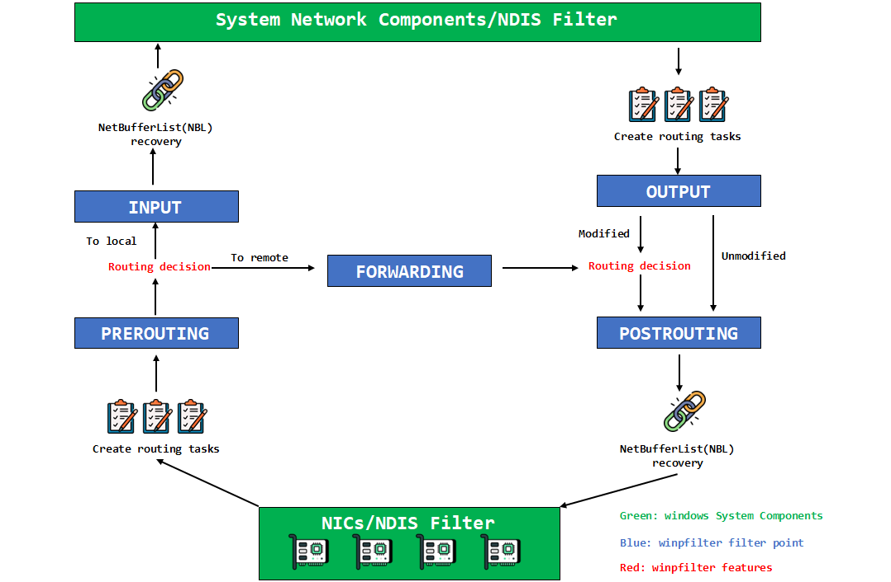
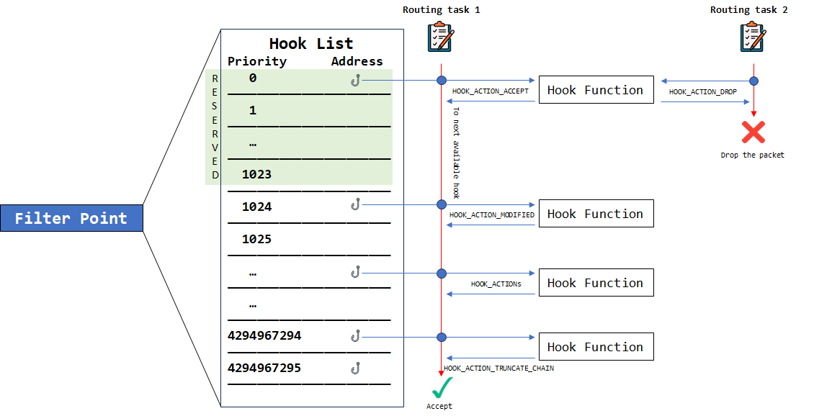

# winpfilter Module Development Guidelines

**Note**: This guide is applicable to winpfilter module development. If you need to modify the winpfilter framework, please refer to the [winpfilter Framework Development Manual](/framework_dev/).

***

## Basic Knowledge of winpfilter

### Framework Structure

winpfilter is a Windows NDIS filtering driver that sits between the protocol driver and the network adapter driver, allowing for flexible monitoring and control of network traffic during data transmission.

### Filter Points

The winpfilter module can mount to five filter points:
> - **(0) FILTER_POINT_PREROUTING** 
> - **(1) FILTER_POINT_INPUT**  
> - **(2) FILTER_POINT_FORWARDING**
> - **(3) FILTER_POINT_OUTPUT**
> - **(4) FILTER_POINT_POSTROUTING**

The positions of the winpfilter filter points and the data packet processing flow are illustrated in the following diagram:



### HOOK Function Processing Chain

When a routing task carrying a data packet reaches a filter point, the filter point will call HOOK functions in the order of their priority from high to low according to the registered HOOK function list. This model is known as the HOOK function processing chain. The filter point will decide whether to pass the data packet to the next HOOK function and whether to allow the data packet based on the return results of each HOOK function.

> :warning: Note: Returning **HOOK_ACTION_TRUNCATE_CHAIN** or **HOOK_ACTION_DROP** from a HOOK function will immediately terminate the current HOOK function processing chain and enter the release confirmation process.
>
> :warning: Note: Terminating the HOOK function processing chain means that HOOK functions with lower priorities (higher priority values) will not participate in the decision-making and processing of this routing task.
>
> :warning: Note: Please use **HOOK_ACTION_TRUNCATE_CHAIN** with caution to avoid unintended impacts on the processing chain.
>
> :warning: Note: HOOK functions with a priority less than 4096 (0-4095) are prohibited from returning **HOOK_ACTION_TRUNCATE_CHAIN**. If this value is returned, it will be processed as **HOOK_ACTION_ACCEPT**.



> :warning: Note: Priorities less than 1024 (0-1023) are reserved for winpfilter components. Please do not register HOOK functions in this range unless necessary to avoid affecting the normal operation of system components.

### Communication Device

During module operation, transactions (such as registering or unregistering HOOK functions) can be submitted to the winpfilter framework through the communication device. The device name is:
```C
#define WINPFILTER_HOOK_MANAGEMENT_DEVICE_NAME L"\\Device\\WinpfilterR0HookCommunicationDevice"
```

You can open this device using the IoGetDeviceObjectPointer function.

When communicating with the winpfilter framework, you need to construct the WINPFILTER_HOOK_OP_STRUCTURE structure.

``` C
#pragma pack (1)
typedef struct _WINPFILTER_HOOK_OP_STRUCTURE
{
	ULONG Mode;
	PVOID HookFunction;
	ULONG Priority;
	FILTER_POINT FilterPoint;
}WINPFILTER_HOOK_OP_STRUCTURE, * PWINPFILTER_HOOK_OP_STRUCTURE;
#pragma pack ()
```

The result of the communication transaction also requires providing a pointer to the WINPFILTER_HOOK_OP_STRUCTURE structure. You can determine the execution result of the transaction by reading the Mode field in the structure. "1 - Success; 0 - Failure" *

***

## winpfilter Module Development

### HOOK Functions

When a network data packet reaches a filter point, the winpfilter framework will call the registered HOOK functions in order of priority based on that filter point.

The prototype for a HOOK function is:
``` C
HOOK_ACTION HookFunction(
    NET_LUID InterfaceLuid, 
    FILTER_POINT FilterPoint, 
    BYTE* Buffer, 
    ULONG BufferLength, 
    ULONG* pDataLength);
```

he possible return values for the HOOK_ACTION are as follows:

``` C 
// Indicates that winpfilter drops the network data packet and immediately terminates the processing chain at the current filter point
HOOK_ACTION_DROP

// Indicates that winpfilter accepts the network data packet
HOOK_ACTION_ACCEPT        

// Indicates that winpfilter accepts the network data packet, but the content of the network data packet has been modified  
HOOK_ACTION_MODIFIED  

// Indicates that winpfilter accepts the network data packet and immediately terminates the processing chain at the current filter point 
HOOK_ACTION_TRUNCATE_CHAIN  
```

> InterfaceLuid: The LUID of the network interface used for receiving or sending (including anticipated sending) the data packet.
> FilterPoint: The filter point triggered by the current data packet.
> Buffer: A pointer to the buffer of the current network data packet.
> BufferLength: The length of the current network data packet buffer.
> pDataLength: A pointer to the variable representing the length of the network data packet

>:warning: Note: If the HOOK function modifies the data packet, please ensure to return HOOK_ACTION_MODIFIED. Otherwise, it may cause system instability.
>:warning: Note: Returning HOOK_ACTION_MODIFIED when the HOOK function does not modify the data packet may significantly degrade system performance.
>:warning: Note: When modifying the size of the data packet, the final length of the data packet must not exceed the provided BufferLength. Otherwise, a buffer overflow may occur. Also, ensure to update the variable pointed to by pDataLength with the modified length of the data packet.

### Registering and Unregistering HOOK Functions

To register or unregister a winpfilter HOOK function, you need to construct the `WINPFILTER_HOOK_OP_STRUCTURE` structure according to the respective function and operation.

>:warning: Note: Before sending a communication request, ensure that you open the correct communication device.

After construction, send this structure data to the winpfilter HOOK management device to complete the registration or unregistration of the winpfilter HOOK function.

Here’s an example of registering a HOOK function at priority 8080 for the Output filter point:

``` C
IO_STATUS_BLOCK StatusBlock;
PIRP HOOKFunctionRegIRP;

WINPFILTER_HOOK_OP_STRUCTURE RegisterHOOKFunction;

RtlZeroMemory(&RegisterHOOKFunction, sizeof(WINPFILTER_HOOK_OP_STRUCTURE));

RegisterHOOKFunction.HookFunction = (PVOID)TargetHOOKFunction;
RegisterHOOKFunction.Priority = 8080;
RegisterHOOKFunction.FilterPoint = FILTER_POINT_OUTPUT;

HOOKFunctionRegIRP = IoBuildDeviceIoControlRequest(
    (ULONG)WINPFILTER_CTL_CODE_REGISTER_HOOK, 
    WinpfilterR0HookCommunicationDeviceObject, 
    &RegisterHOOKFunction, 
    sizeof(WINPFILTER_HOOK_OP_STRUCTURE), 
    &RegisterHOOKFunction, 
    sizeof(WINPFILTER_HOOK_OP_STRUCTURE), 
    FALSE, 
    NULL, 
    &StatusBlock);

IoCallDriver(WinpfilterR0HookCommunicationDeviceObject, HOOKFunctionRegIRP);

```

To unregister a HOOK function, you can send a transaction request in the same way, but ensure you use the correct CTL_CODE:

**WINPFILTER_CTL_CODE_REGISTER_HOOK** is the CTL_CODE for registering a HOOK function;

**WINPFILTER_CTL_CODE_UNREGISTER_HOOK** is the CTL_CODE for unregistering a HOOK function.


### winpfilter Network Packet Parsing Tools

To facilitate developers in handling network data packets, winpfilter provides a variety of[Network Packet Parsing Tools](/network.h/)。

***

## winpfilter Module Examples
Want to learn more about winpfilter module development? The examples in the[winpfilter module example repository](https://github.com/winpfilter/winpfilter-samples)can be a reference.