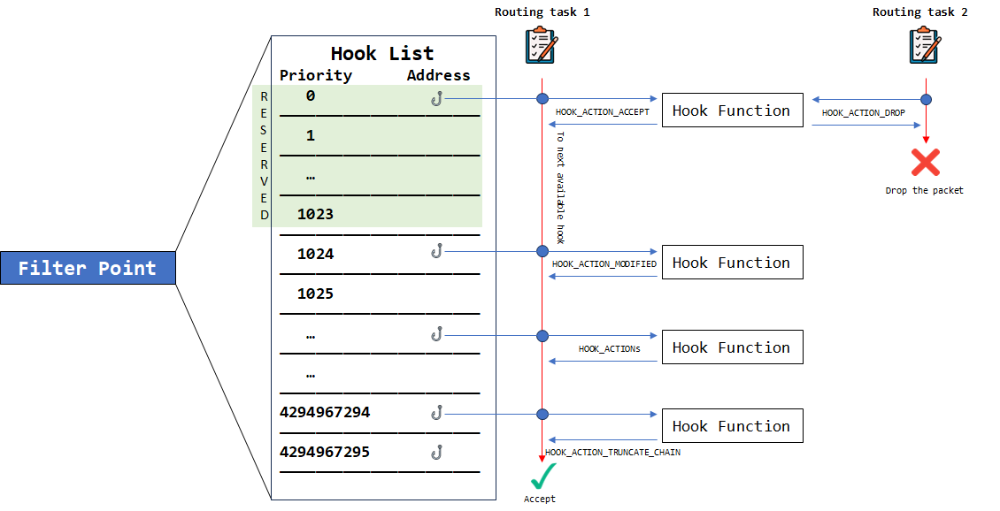

# winpfilter 模块开发指南

注意：本指南适用与winpfilter模块开发，若需要对winpfilter框架进行修改，请参阅[winpfilter 框架开发手册](/zh-cn/framework_dev/)

***

## winpfilter 基础知识

### 框架结构

winpfilter为windows NDIS过滤驱动程序，其位于协议驱动程序和网络适配器驱动程序之间，可以在数据传输过程中对网络流量进行灵活的监控和控制。

### 过滤点

winpfilter模块可挂载的过滤点有5个，分别为:
> -  **(0) FILTER_POINT_PREROUTING** 
> -  **(1) FILTER_POINT_INPUT**  
> -  **(2) FILTER_POINT_FORWARDING**
> -  **(3) FILTER_POINT_OUTPUT**
> -  **(4) FILTER_POINT_POSTROUTING**

winpfilter各过滤点位置及数据包处理流程如下图所示：


### 过滤点HOOK函数处理链
当载有数据包的路由任务到达过滤点时，过滤点将会按照HOOK函数注册列表自高至低优先级调用HOOK函数，此模型被称为HOOK函数处理链。过滤点将会根据处理链上每个HOOK函数的返回结果决定是否继续将数据包传送至下一个HOOK函数并决定是否放行数据包。

> :warning:注意：HOOK函数返回**HOOK_ACTION_TRUNCATE_CHAIN**或**HOOK_ACTION_DROP**会立即终止当前HOOK函数处理链并进入放行确认流程。
>
> :warning:注意：终止HOOK函数处理链意味着比当前优先级低(Priority数值大)的HOOK函数将不会参与到本次路由任务的决策与处理中。
>
>:warning:注意：请慎用**HOOK_ACTION_TRUNCATE_CHAIN**以免因HOOK函数处理链终止造成影响。
>
>:warning:注意：在优先级小于4096(0-4095)的HOOK函数中禁止返回**HOOK_ACTION_TRUNCATE_CHAIN**，若返回此值，将会按照**HOOK_ACTION_ACCEPT**处理。



>:warning:注意：小于1024(0-1023)的优先级为winpfilter组件保留优先级，若非必要请勿将HOOK函数注册在此范围内以免影响系统组件正常运行。


### 通讯设备

在模块运行过程中，可向winpfilter框架通讯设备提交事务(如注册、注销HOOK函数等)。通讯设备名称为：
``` C
#define WINPFILTER_HOOK_MANAGEMENT_DEVICE_NAME L"\\Device\\WinpfilterR0HookCommunicationDevice"
```

使用时，可通过**IoGetDeviceObjectPointer**函数打开该设备。

在与winpfilter框架通讯时，需构建WINPFILTER_HOOK_OP_STRUCTURE结构体。

``` C
#pragma pack (1)
typedef struct _WINPFILTER_HOOK_OP_STRUCTURE
{
	ULONG Mode;
	PVOID HookFunction;
	ULONG Priority;
	FILTER_POINT FilterPoint;
}WINPFILTER_HOOK_OP_STRUCTURE, * PWINPFILTER_HOOK_OP_STRUCTURE;
#pragma pack ()
```


通讯事务结果的返回同样需要提供指向WINPFILTER_HOOK_OP_STRUCTURE结构体的指针，通过读取该结构体中Mode字段判断事务执行结果。`"1 - 成功 ; 0 - 失败" *`

***

## winpfilter 模块开发

### HOOK函数

当网络数据包到达过滤点时，winpfilter框架会根据该过滤点的HOOK函数注册列表按优先级顺序调用HOOK函数。

HOOK函数原型为：
``` C
HOOK_ACTION HookFunction(
    NET_LUID InterfaceLuid, 
    FILTER_POINT FilterPoint, 
    BYTE* Buffer, 
    ULONG BufferLength, 
    ULONG* pDataLength);
```

其中函数返回的 HOOK_ACTION 可取的值如下：

``` C 
//指示winpfilter丢弃本网络数据包，并立即终止本数据包在当前过滤点的处理链
HOOK_ACTION_DROP

//指示winpfilter通过本网络数据包
HOOK_ACTION_ACCEPT        

//指示winpfilter通过本网络数据包、但在HOOK函数中修改了网络数据包的内容  
HOOK_ACTION_MODIFIED  

//指示winpfilter通过本网络数据包，且立即终止本数据包在当前过滤点的处理链 
HOOK_ACTION_TRUNCATE_CHAIN  
```
> - InterfaceLuid 传入网络数据包接收或发送(包含预计发送)使用的网卡(NIC)Luid
> - FilterPoint 传入当前数据包触发的winpfilter过滤点
> - Buffer 传入当前网络数据包的缓冲区指针
> - BufferLength 传入当前网络数据包的缓冲区长度
> - pDataLength 传入指向网络数据包长度变量的指针

> :warning:注意：若HOOK函数对数据包进行修改，请务必返回HOOK_ACTION_MODIFIED，否则可能会出现系统故障
>
>:warning:注意：当HOOK函数未对数据包进行修改时返回HOOK_ACTION_MODIFIED会大幅降低系统运行效率
>
>:warning:注意：当对数据包大小进行修改时，数据包最终长度不得超过传入的BufferLength，否则可能出现缓冲区溢出；且需将pDataLength指针指向的变量修改为修改完成后数据包的长度。

### 注册与注销HOOK函数

注册、注销winpfilter HOOK函数时，需要根据相应函数和操作构建`WINPFILTER_HOOK_OP_STRUCTURE`结构体。

>:warning:注意：在通讯请求前，请打开正确的通讯设备。

构建完成后，向winpfilter HOOK管理设备发送该结构体数据，即可完成winpfilter HOOK函数的注册与注销。

下方给出一个通过构建IRP将HOOK函数以优先级8080注册在Output过滤点上的示例：

``` C
IO_STATUS_BLOCK StatusBlock;
PIRP HOOKFunctionRegIRP;

WINPFILTER_HOOK_OP_STRUCTURE RegisterHOOKFunction;

RtlZeroMemory(&RegisterHOOKFunction, sizeof(WINPFILTER_HOOK_OP_STRUCTURE));

RegisterHOOKFunction.HookFunction = (PVOID)TargetHOOKFunction;
RegisterHOOKFunction.Priority = 8080;
RegisterHOOKFunction.FilterPoint = FILTER_POINT_OUTPUT;

HOOKFunctionRegIRP = IoBuildDeviceIoControlRequest(
    (ULONG)WINPFILTER_CTL_CODE_REGISTER_HOOK, 
    WinpfilterR0HookCommunicationDeviceObject, 
    &RegisterHOOKFunction, 
    sizeof(WINPFILTER_HOOK_OP_STRUCTURE), 
    &RegisterHOOKFunction, 
    sizeof(WINPFILTER_HOOK_OP_STRUCTURE), 
    FALSE, 
    NULL, 
    &StatusBlock);

IoCallDriver(WinpfilterR0HookCommunicationDeviceObject, HOOKFunctionRegIRP);

```

若需注销HOOK函数，可以按相同方式发送事务请求，其中需要填写正确的CTL_CODE:

**WINPFILTER_CTL_CODE_REGISTER_HOOK**为注册HOOK函数的CTL_CODE；

**WINPFILTER_CTL_CODE_UNREGISTER_HOOK**为注销HOOK函数的CTL_CODE；


### winpfilter 网络报文解析工具

为方便开发者对网络数据包的处理，winpfilter提供了丰富的[网络报文解析工具](/zh-cn/network.h/)。

***

## winpfilter 模块示例
想进一步了解winpfilter模块开发？[winpfilter模块示例仓库](https://github.com/winpfilter/winpfilter-samples)中的示例可做参考。